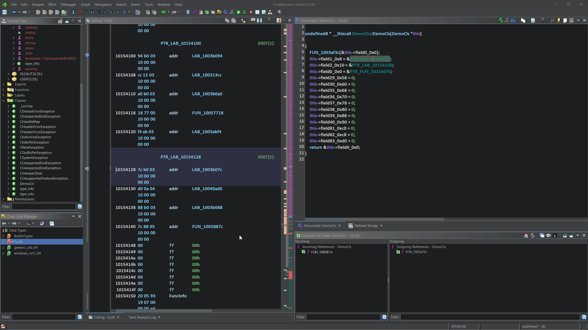

# DecompFuncUtils

A powerful Ghidra extension that enhances the decompiler with C++ reverse engineering utilities, including VTable reconstruction, struct field navigation, and inter-procedural taint analysis.


---

## Features

### 🔷 VTable Handler
Automatically create and update vtable structures directly from the decompiler view. The plugin scans memory for function pointers and generates properly named struct fields based on the target function names.



**Capabilities:**
- Right-click on a vtable label or DATA reference in the decompiler
- Automatically scans for valid function pointers (supports 32/64-bit)
- Creates a struct with fields named after target functions
- Handles duplicate function names with automatic suffixes
- Updates existing vtable structures when the table changes

### 🔷 Struct Field Navigation
Double-click or use `Ctrl+G` on struct field names in the decompiler to navigate directly to the referenced function or label.

**Use case:** When analyzing a vtable like `vtable->doSomething`, double-clicking on `doSomething` jumps directly to that function.

### 🔷 Memory-to-Struct Converter
Select a memory region in the Listing view and instantly create a struct with automatic field naming based on symbol references.

**Capabilities:**
- Select any memory range containing pointers
- Automatically resolves pointer targets to symbols/functions
- Creates sanitized field names from referenced symbols
- Applies the new struct at the selection address

### 🔷 Inter-Procedural Taint Analysis
Advanced data flow analysis using sparse matrix representation for efficient taint propagation across function boundaries.

**Capabilities:**
- Forward and backward taint tracking
- Follows calls up to N levels deep (configurable)
- Visual highlighting of tainted variables in decompiler
- Detailed logging panel showing matrices, edges, and propagation steps
- Custom taint query language for complex analysis patterns
- Source/sink detection with configurable thresholds

---

## Installation

### From Release
1. Download the latest `.zip` from the [Releases](../../releases) page
2. In Ghidra: **File → Install Extensions → Add Extension**
3. Select the downloaded zip file
4. Restart Ghidra

### From Source
```bash
# Set your Ghidra installation path
export GHIDRA_INSTALL_DIR="/path/to/ghidra"

# Build the extension
gradle buildExtension
```

The built extension will be in `dist/`.

---

## Usage

### VTable Handler

1. In the Decompiler view, locate a constructor or function that references a vtable
2. Right-click on the vtable label (e.g., `PTR_LAB_10154100`)
3. Select **"Create/Update VTable Structure"**
4. Enter a name for the vtable struct
5. The plugin creates the struct and applies it at the vtable address

### Struct Field Navigation

- **Double-click** on any struct field name in the decompiler
- Or use **Ctrl+G** with the cursor on a field name
- The plugin navigates to the target function/label if found

### Memory-to-Struct Converter

1. In the Listing view, select a memory region (click and drag)
2. Right-click and select **"Create Struct from Selection"**
3. Enter a name for the new struct
4. The struct is created with pointer fields named after referenced symbols

### Taint Analysis

1. Open **Window → Taint Analysis Log** to view results
2. Right-click on a variable in the decompiler
3. Select from the **Taint Analysis** submenu:
   - **Forward Taint** - Where does this data flow?
   - **Backward Taint** - What data reaches this variable?
   - **Inter-procedural Analysis** - Follow taint across function calls

---

## Requirements

- **Ghidra** 11.0 or later
- **Java** 17 or later
- **Gradle** (version matching your Ghidra installation)

---

## License

This project is licensed under the Apache License 2.0 - see the [LICENSE](LICENSE) file for details.

---

## Author

**Tomer Goldschmidt**

---

## Acknowledgments

- [Ghidra](https://ghidra-sre.org/) - NSA's software reverse engineering framework
- The Ghidra development community
