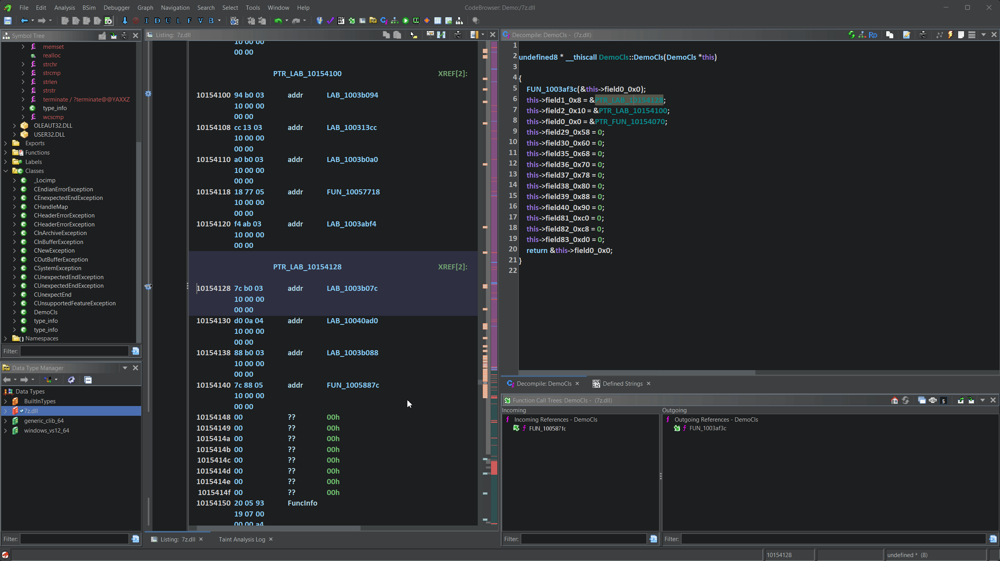

# DecompFuncUtils

A Ghidra extension that enhances the decompiler with C++ reverse engineering utilities, including VTable reconstruction, struct field navigation, and inter-procedural taint analysis.


---

## Installin The Plugin (Or Any Other Plugin)
- How to install the plugin you download from the releases.


## Features

### 🔷 Memory-to-Struct Converter
Select a memory region in the Listing view and instantly create a struct with automatic field naming based on symbol references.

**Capabilities:**
- Select any memory range containing pointers
- Automatically resolves pointer targets to symbols/functions
- Creates sanitized field names from referenced symbols
- Applies the new struct at the selection address



**Capabilities:**
- Right-click on a vtable label or DATA reference in the decompiler
- Automatically scans for valid function pointers (supports 32/64-bit)
- Creates a struct with fields named after target functions
- Handles duplicate function names with automatic suffixes
- Updates existing vtable structures when the table changes

### 🔷 Struct Field Navigation
Double-click or use `Ctrl+G` on struct field names in the decompiler to navigate directly to the referenced function or label.

**Use case:** When analyzing a vtable like `vtable->doSomething`, double-clicking on `doSomething` jumps directly to that function.

---

## Installation

### From Release
1. Download the latest `.zip` from the [Releases](../../releases) page
2. In Ghidra: **File → Install Extensions → Add Extension**
3. Select the downloaded zip file
4. Restart Ghidra

### From Source
```bash
# Set your Ghidra installation path
export GHIDRA_INSTALL_DIR="/path/to/ghidra"

# Build the extension
gradle buildExtension
```

The built extension will be in `dist/`.

---

## Usage

### VTable Handler

1. In the Decompiler view, locate a constructor or function that references a vtable
2. Right-click on the vtable label (e.g., `PTR_LAB_10154100`)
3. Select **"Create/Update VTable Structure"**
4. Enter a name for the vtable struct
5. The plugin creates the struct and applies it at the vtable address

### Struct Field Navigation

- **Double-click** on any struct field name in the decompiler
- Or use **Ctrl+G** with the cursor on a field name
- The plugin navigates to the target function/label if found

### Memory-to-Struct Converter

1. In the Listing view, select a memory region (click and drag)
2. Right-click and select **"Create Struct from Selection"**
3. Enter a name for the new struct
4. The struct is created with pointer fields named after referenced symbols

---

## MCP Server (AI Agent Integration)

The plugin exposes Ghidra to AI agents over MCP. Each Ghidra tool window serves
**both** MCP transports on its own port, because different clients speak
different ones:

| Endpoint | Transport | Used by |
|---|---|---|
| `POST /mcp` | Streamable HTTP (spec 2025-03-26+) | Codex, most modern clients |
| `GET /sse` + `POST /message` | Legacy HTTP+SSE (spec 2024-11-05) | Claude Code (`"type": "sse"`) |
| `GET /discovery` | Plain JSON status (not MCP) | launchers, health checks |

`initialize` negotiates the protocol revision: the server echoes the client's
requested version when it is one of `2024-11-05`, `2025-03-26`, `2025-06-18`,
and otherwise answers with the newest it supports.

### Taint analysis through MCP

Call `ghidra_taint_query` with a preset to start without writing the pattern DSL:

```json
{"preset":"tainted_copy_length","maxFunctions":100}
```

Available presets are `tainted_copy_length` (tainted `memcpy` length),
`tainted_format` (tainted `printf` format), `use_after_free` (direct dereference
following `free`), and `double_free`. These report candidates for investigation.
Provide either `preset` or `query`, never both. To focus on one function:

```json
{"preset":"tainted_format","functionName":"fmt"}
```

For a custom source-specific query:

```json
{"query":"PATTERN p { printf($fmt); } WHERE tainted($fmt, \"getenv\")","maxFunctions":100}
```

For each page, inspect `functionsScanned` (attempted), `functionsAnalyzed`
(successful), and `failures` (addresses and reasons). When `truncated` is true,
pass `nextStartAfter` as `startAfter` with the same query and limit to continue.
Keep the program unchanged while paging. Retry failed functions individually
using `functionAddress`, optionally with a longer `decompileTimeout`.
`complete` reports coverage of the requested scope/page remainder; an empty
match list does not prove safety. Pointer writes, aliases, indirect calls, and
interprocedural source reachability remain approximate.

Use `ghidra_taint_forward` or `ghidra_taint_backward` with `functionName`,
`variableName`, and `maxDepth` to investigate a candidate further. Query results
include function and match addresses so you can decompile or navigate directly
to the finding using the existing MCP tools.

### How Codex connects

Codex's MCP client (rmcp) supports **stdio and Streamable HTTP only — there is no
legacy SSE transport**. Pointing Codex at `/sse` fails before `initialize`: it
POSTs the handshake and `/sse` answers `GET` only, so the request is rejected
with `405 Method Not Allowed`. Codex must therefore use `/mcp`.

The committed `.codex/config.toml` does this:

```toml
[mcp_servers.ghidra]
url = "http://127.0.0.1:13101/mcp"
```

Two caveats worth knowing:

- Codex reads a project's `.codex/config.toml` **only for trusted projects**.
  If `codex mcp list` doesn't show `ghidra`, accept Codex's "trust this folder?"
  prompt, or register it globally with
  `codex mcp add ghidra --url http://127.0.0.1:13100/mcp`.
- TOML has no environment-variable interpolation, so that port is literal. It is
  pinned to the window that was live when it was written, and a restarted
  Ghidra may claim a different port — check with `./tools/ghidra-claude.ps1 -List`
  and either edit the file or retarget per session with the launcher below or
  `codex -c mcp_servers.ghidra.url="http://127.0.0.1:13102/mcp"`.

The first time an agent calls a Ghidra tool, Codex asks you to approve it — that
approval prompt is normal and unrelated to the transport. (In `codex exec`,
which cannot prompt, MCP tool calls are auto-cancelled.)

### How Claude Code connects

Claude Code uses the legacy SSE transport via the committed `.mcp.json`:

```json
{ "mcpServers": { "ghidra": { "type": "sse",
  "url": "${GHIDRA_MCP_URL:-http://127.0.0.1:13100/sse}" } } }
```

Unlike Codex's config, this one *does* interpolate, so `GHIDRA_MCP_URL` chooses
the window. Note that `/sse` is a long-lived stream: once open it stays open,
sending a `: keepalive` comment every 30s. **That is the healthy steady state,
not a hang** — responses to your `POST /message` calls arrive as `event: message`
frames on that stream.

### One server per tool window (13100–13149)

The unit of parallelism is the **Ghidra tool window**, not the Ghidra process.
Each window that carries the plugin runs its own MCP server on its own port and
serves *that window's* active program — so `CodeBrowser` and `CodeBrowser(2)` in
one Ghidra are two independent lanes for two agent sessions. This matters because
a Ghidra project is locked to a single process: several windows are the only way
to work on several binaries of the same project at once.

When a server starts it takes the first free port beginning at the configured one
(default `13100`, under *Edit → Tool Options → MCP Server*), so the second window
lands on `13101`, the third on `13102`, and so on — across windows and across
processes alike. Each window advertises itself in
`~/.ghidra-mcp/server-<pid>-<port>.json` with its port, window name, project, and
loaded binaries; several files share a pid when one Ghidra hosts several windows.
Stale files (dead process, or a window that closed hard) are pruned on start.

*MCP Auto Start* is on by default, so a newly opened window claims a port by
itself — provided the plugin is part of the tool config you launch it from
(configure it once via *File → Configure*, then *File → Save Tool*).

```powershell
./tools/ghidra-claude.ps1 -List                      # every live window + port + binaries
curl http://127.0.0.1:13101/discovery                # one window's status
```

### Running multiple sessions in parallel

You can drive several binaries at once with no cross-talk, one agent session per
window.

1. Add a lane. Any of:
   - **From Ghidra:** `Tools → MCP Server → New MCP Window` — opens another window
     on the current program, starts its server, and tells you its port.
   - **From an agent:** `ghidra_open_in_new_window` with a program name — opens
     that binary in a fresh window and returns the new port plus the attach
     command. `ghidra_list_windows` shows every lane and which one you are in.
   - **By hand:** open a second CodeBrowser from the project window
     (`Tools → Run Tool`, or double-click a second binary) — with auto-start it
     claims the next port on its own.
2. In a terminal, launch the agent bound to a specific window. PowerShell:

   ```powershell
   ./tools/ghidra-claude.ps1 -Binary libfoo.so                 # Claude -> window with libfoo.so
   ./tools/ghidra-claude.ps1 -Window 'CodeBrowser(2)'          # pick a window by name
   ./tools/ghidra-claude.ps1 -Client codex -Binary libfoo.so   # Codex  -> same window
   ./tools/ghidra-claude.ps1 -Port 13101                       # pin an exact port
   ./tools/ghidra-claude.ps1 -List                             # just list the live windows
   ```

   Or Bash (Linux/macOS/Git Bash — needs `curl` and either `jq` or `python`):

   ```bash
   ./tools/ghidra-claude.sh --binary libfoo.so
   ./tools/ghidra-claude.sh --window 'CodeBrowser(2)'
   ./tools/ghidra-claude.sh --client codex --binary libfoo.so
   ./tools/ghidra-claude.sh --port 13101
   ./tools/ghidra-claude.sh --list
   ```

   For Claude the launcher exports `GHIDRA_MCP_URL`; for Codex it passes
   `-c mcp_servers.ghidra.url=.../mcp`. Either way the agent starts in the same
   shell, bound to one window. Repeat in another terminal for another binary.

Each session gets its own port, its own window and that window's active program;
the `initialize` response tells the agent which window it landed in. Separate
Ghidra *processes* additionally isolate the JVM and the project database, so use
those for unrelated projects. Two sessions on the *same* program — whether via
two windows or two processes — is still not recommended: the database is
protected from corruption (EDT-serialized, per-call transactions), but the
sessions will logically overwrite each other's renames and structs. Pass
`closeHere: true` to `ghidra_open_in_new_window` to hand a program over to the
new lane instead of holding it in both.

Costs of sharing one process: all windows share one Swing event thread, so a long
mutating call in one window makes the others' GUI wait its turn, and a JVM crash
takes every lane with it.

### Troubleshooting: "server reachable but handshake fails"

Run the probe — it performs the real handshake on both transports and reports
each step:

```powershell
./tools/mcp-handshake-probe.ps1 -Port 13101      # both transports
./tools/mcp-handshake-probe.ps1 -Transport http  # just Codex's path
```

It resolves the target from `-Port`, `-Url`, `$env:GHIDRA_MCP_URL`, or the single
live server in `~/.ghidra-mcp`, and exits non-zero if any step fails. Common
outcomes:

| Symptom | Cause | Fix |
|---|---|---|
| `POST /mcp` → 404 or 405, `/sse` fine | Ghidra is running an older build with no `/mcp` endpoint | Close Ghidra, install the current extension, restart. The endpoint is created at server start, so restarting *just* the MCP server is not enough. |
| `POST /sse` → 405 | A Streamable HTTP client was pointed at the legacy endpoint | Use the `/mcp` URL for that client. |
| `/discovery` unreachable | Server not started, or wrong port | `Tools → MCP Server → Start`; confirm the port with `-List`. |
| Client reports a timeout on `GET /sse` | The stream is *supposed* to stay open | Not a failure. Check for a real error on the `POST /message` side instead. |
| Handshake fine, tool call denied | Client-side approval prompt (Codex) | Approve the tool; in `codex exec` MCP calls are auto-cancelled. |
| Tools list, but calls fail with "No program is currently open" | Server is up before a binary is loaded | Open a program, or call `ghidra_open_program` first. |

Regression tests for both transports (in-process, against a real headless
Ghidra) live in `tests/`:

```powershell
./tests/run_headless_test.ps1 -Script McpTransportHeadlessTest.java
```

---

## Requirements

- **Ghidra** 11.0 or later
- **Java** 17 or later
- **Gradle** (version matching your Ghidra installation)

---

## License

This project is licensed under the Apache License 2.0 - see the [LICENSE](LICENSE) file for details.

---

## Author

**Tomer Goldschmidt**

---

